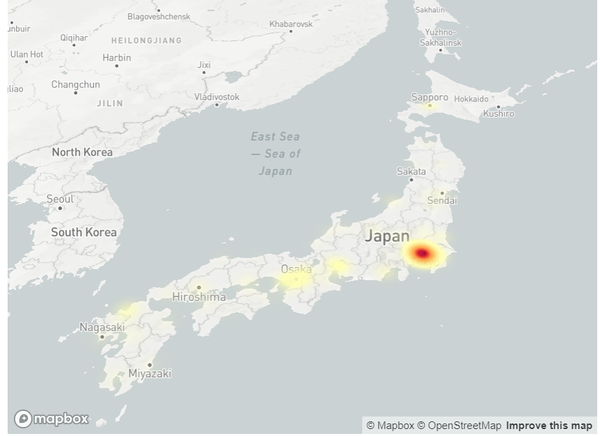

# Python_statistics_ml

It shows population in each prefecture in Japan.

# DEMO



# Usage

```bash
streamlit run Python_map_polulation.py
```
# 

# Requirement

* Python 3.9

# Author

* M.Kobayashi