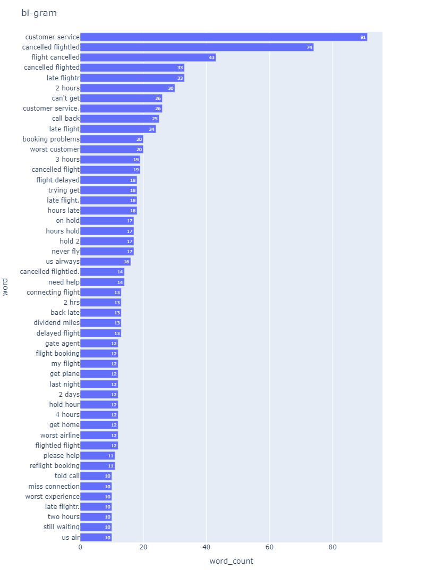

# Python_sentiment_anlysis

* step0: Extract tweets labeled as "negative" and save it.
* step1: Show N-gram frequency graphs and co-occurrence network graph as a result of the analysis.

# DEMO

You can see candidate reasons why the tweets are tagged as "negative".
"customer service", "cancelled flight", "late flight" can be some of the reasons.



# Usage

```bash
00_get_negativeTweet.ipynb
01_negativeTweetAnalysis.ipynb
```
# Ref

* [Twitter US Airline Sentiment](https://www.kaggle.com/datasets/crowdflower/twitter-airline-sentiment)

* [nlplot](https://github.com/takapy0210/nlplot)

# My envirionment/ Requirement

* Python 3.9
* nlplot

# Author

* M.Kobayashi