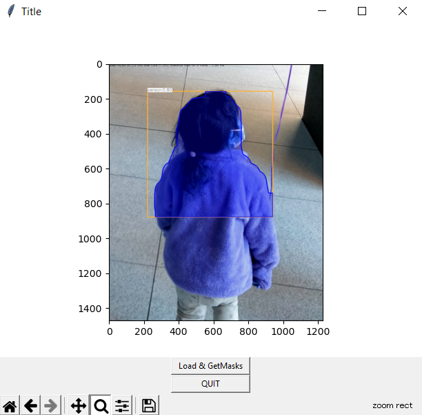

# Python_tkinter_MaskRNN

1) press Load & GetMasks
2) segmented Image is shown
3) mask imges of each segment is saved

# DEMO



# Usage

```bash
python Python_tkinter_MaskRNN.py
```
# Ref

[Learn OpenCV](https://github.com/spmallick/learnopencv)

# Requirement

* Python 3.9

# Author

* M.Kobayashi